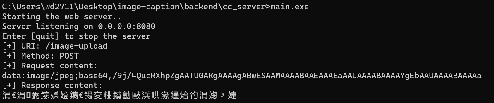

# http_server

This module is receive POST request from frontend, and run AI model, then return response. I have give you task.json/settings.json/c_cpp_properties.json in .vscode folder. You can copy and run in your vscode.

This server refers to [link1](https://github.com/trungams/http-server/tree/master/src).

You should know that:

- Here are some bugs in my program, for example, if you send images from frontend, backend possibly return `transfer error`, and I don't know why.
- You should change `PYTHONHOME_V` and `PYTHONPATH_V` to your own python path.

